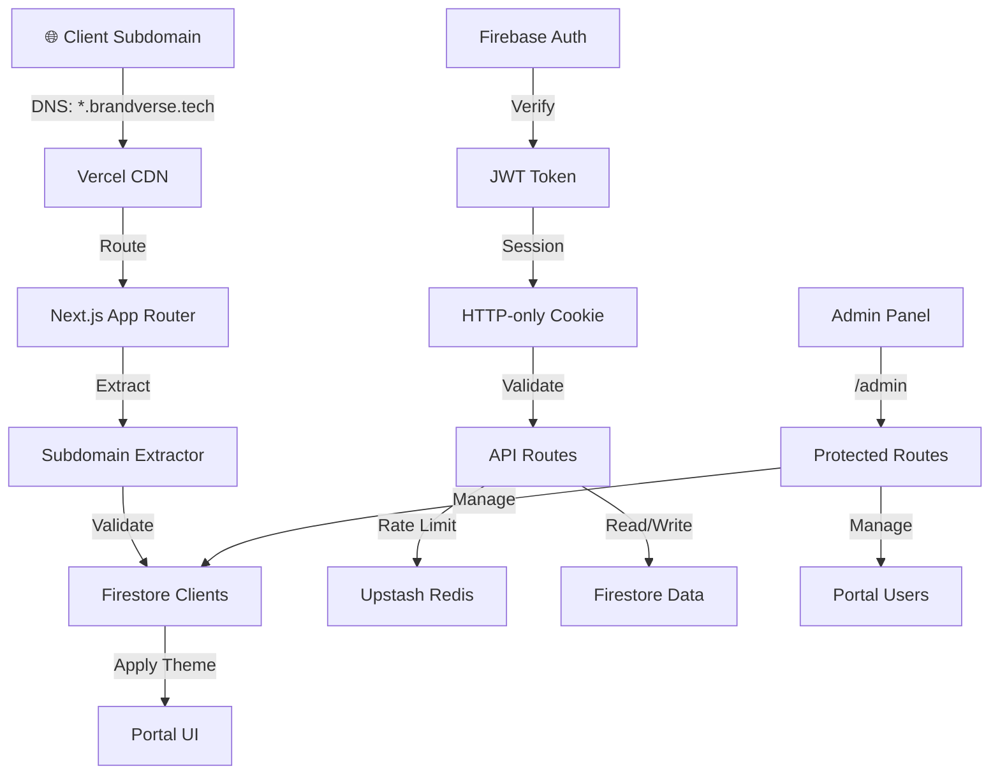

# Brandverse - Multi-Tenant SaaS Portal


A production-grade **multi-tenant SaaS portal** for managing AI voice agents and chatbots. Each client accesses their branded portal via unique subdomains (`client.brandverse.tech`).

## 🎯 Key Features

- ✅ **Multi-Tenant Architecture**: Subdomain-based routing with complete tenant isolation
- ✅ **Dynamic Client Theming**: Per-client branding (colors, logos, features)
- ✅ **Firebase Authentication**: Email/password with JWT session management
- ✅ **Rate Limiting**: Upstash Redis-powered request throttling
- ✅ **Admin Panel**: System-wide client management and monitoring
- ✅ **Security First**: Input validation, CORS, HTTP-only cookies, Firestore rules
- ✅ **TypeScript**: 100% type-safe codebase
- ✅ **Production Optimized**: Lazy-loaded Firebase Admin SDK, build-time verification

---

## 📊 Architecture Overview



### System Components

| Component | Technology | Purpose |
|-----------|-----------|---------|
| **Frontend** | Next.js 16 (App Router) | Portal UI & Admin Panel |
| **Backend** | Next.js API Routes | Authentication, data validation, proxying |
| **Database** | Firebase Firestore | Client data, users, activity logs |
| **Auth** | Firebase Auth + JWT | User authentication & session management |
| **Rate Limiting** | Upstash Redis | Request throttling & DDoS protection |
| **Hosting** | Vercel | CDN deployment with edge optimization |
| **DNS** | Cloudflare | Wildcard CNAME routing (*.brandverse.tech) |

---

## 🚀 Quick Start

### Prerequisites
- Node.js 18+
- npm or yarn
- Firebase project
- Upstash Redis account

### Installation

```bash
# Clone repository
git clone https://github.com/brandverse/portal.git
cd portal

# Install dependencies
npm install

# Create environment file
cp .env.example .env.local

# Add Firebase and Upstash credentials to .env.local
# (See DEPLOY.md for detailed instructions)

# Start development server
npm run dev

# Open browser
open http://localhost:3000/portal
```

### Development

```bash
# Run development server with hot reload
npm run dev

# Type check
npm run type-check

# Build for production
npm run build

# Run production build locally
npm start

# Run linting
npm run lint
```

---

## 📁 Project Structure

```
brandverse/
├── app/
│   ├── api/
│   │   ├── auth/
│   │   │   ├── login/route.ts          # Email/password authentication
│   │   │   ├── logout/route.ts         # Session cleanup
│   │   │   ├── register/route.ts       # New user registration
│   │   │   └── me/route.ts             # Current user profile
│   │   ├── clients/
│   │   │   ├── route.ts                # List all clients (admin only)
│   │   │   └── [clientId]/route.ts     # Get client details
│   │   ├── validate-session/route.ts   # Session verification
│   │   ├── admin/
│   │   │   └── create-client/route.ts  # Create new client (admin only)
│   │   └── health/route.ts             # Health check endpoint
│   ├── portal/
│   │   ├── layout.tsx                  # Portal theme wrapper
│   │   ├── page.tsx                    # Login page
│   │   ├── dashboard/
│   │   │   ├── page.tsx                # Main dashboard
│   │   │   ├── analytics/page.tsx      # Client analytics
│   │   │   ├── deployments/page.tsx    # Deployed bots/agents
│   │   │   ├── settings/page.tsx       # Client settings
│   │   │   └── layout.tsx              # Authenticated layout
│   │   ├── profile/page.tsx            # User profile
│   │   └── unauthorized.tsx            # Access denied page
│   ├── admin/
│   │   ├── layout.tsx                  # Admin protected layout
│   │   ├── page.tsx                    # Client management dashboard
│   │   ├── clients/[clientId]/page.tsx # Edit client
│   │   └── users/page.tsx              # User management
│   └── layout.tsx                      # Root layout
├── lib/
│   ├── firebase/
│   │   ├── admin.ts                    # Admin SDK initialization
│   │   ├── client.ts                   # Client SDK initialization
│   │   └── auth.ts                     # Auth helper functions
│   ├── portal/
│   │   ├── subdomain.ts                # Subdomain extraction logic
│   │   ├── clients.ts                  # Firestore client queries
│   │   ├── users.ts                    # Firestore user queries
│   │   ├── sessions.ts                 # JWT session management
│   │   ├── useClientTheme.ts           # React hook for theme
│   │   └── useAuth.ts                  # React hook for auth
│   ├── security/
│   │   ├── rateLimit.ts                # Upstash rate limiting
│   │   ├── validators.ts               # Input validation schemas
│   │   ├── csrf.ts                     # CSRF protection
│   │   └── encryption.ts               # Data encryption utilities
│   ├── types/
│   │   └── index.ts                    # TypeScript interfaces
│   └── utils/
│       ├── errors.ts                   # Error handling
│       ├── logger.ts                   # Structured logging
│       └── response.ts                 # Standardized API responses
├── middleware.ts                       # Request interceptors
├── next.config.mjs                     # Next.js configuration
├── tsconfig.json                       # TypeScript configuration
├── tailwind.config.ts                  # Tailwind CSS configuration
├── .env.example                        # Environment template
├── .env.local                          # Local environment (git-ignored)
├── .gitignore                          # Git ignore patterns
└── package.json                        # Dependencies & scripts
```

---

## 🔐 Security Features

### Multi-Tenant Isolation
- ✅ Subdomain validation on every request
- ✅ Client ownership verification for all data access
- ✅ Firestore security rules prevent unauthorized access
- ✅ JWT tokens include client context

### Authentication & Session
- ✅ Firebase Authentication for user management
- ✅ JWT tokens (7-day expiry) for stateless sessions
- ✅ HTTP-only cookies prevent XSS attacks
- ✅ Secure flag ensures HTTPS-only transmission

### Rate Limiting
- ✅ 5 login attempts per 15 minutes per IP
- ✅ 60 API calls per minute per user
- ✅ Upstash Redis for distributed rate limiting

### Input Validation
- ✅ Zod schemas for request body validation
- ✅ Email format & password strength verification
- ✅ Subdomain alphanumeric validation
- ✅ XSS prevention on all outputs

### Data Protection
- ✅ End-to-end HTTPS encryption
- ✅ CORS restricted to brandverse.tech domains
- ✅ CSRF tokens on state-changing operations
- ✅ Content Security Policy headers

---

## 📊 Database Schema

### Firestore Collections

#### `clients` - Client company data
```typescript
{
  id: "client-a"  // Subdomain
  name: "Client A Inc"
  subdomain: "client-a"
  theme: {
    primaryColor: "#FF6B6B"
    secondaryColor: "#FFB8B8"
    backgroundColor: "#FFF0F0"
    accentColor: "#FF8A8A"
  }
  features: {
    dashboard: true
    analytics: true
    deployments: true
    settings: true
  }
  status: "active" | "suspended" | "inactive"
  plan: "starter" | "pro" | "enterprise"
  createdAt: timestamp
  updatedAt: timestamp
}
```

#### `portal_users` - Client employees
```typescript
{
  id: uid  // Firebase Auth UID
  clientId: "client-a"
  email: "user@client-a.com"
  fullName: "John Doe"
  role: "admin" | "user" | "viewer"
  avatar: "https://..."
  permissions: string[]
  createdAt: timestamp
  lastLogin: timestamp
  status: "active" | "suspended"
}
```

#### `activity_logs` - Audit trail
```typescript
{
  id: auto-generated
  clientId: "phantomcat"
  userId: uid
  action: "login" | "create_bot" | "deploy" | "settings_update"
  details: any
  ipAddress: string
  timestamp: timestamp
}
```

---

## 🚢 Deployment

See [DEPLOY.md](./DEPLOY.md) for complete deployment instructions.

### Quick Deploy to Vercel

```bash
# Install Vercel CLI
npm install -g vercel

# Deploy
vercel deploy --prod

# Add environment variables (or via Vercel dashboard)
vercel env add FIREBASE_PROJECT_ID
vercel env add FIREBASE_CLIENT_EMAIL
# ... add all other variables
```

---

## 📈 Monitoring & Logging

### Application Logs
- Auth events logged to Firestore `activity_logs`
- API errors logged with request context
- Rate limit hits tracked
- Failed login attempts monitored

### Vercel Analytics
- Build times and deployment status
- Runtime errors and edge function performance
- Web Core Vitals (LCP, FID, CLS)

---

## 🔄 API Endpoints

### Authentication
- `POST /api/auth/register` - Create new user account
- `POST /api/auth/login` - Authenticate user
- `POST /api/auth/logout` - Clear session
- `GET /api/auth/me` - Get current user

### Client Data
- `GET /api/clients` - List all clients (admin only)
- `GET /api/clients/[clientId]` - Get client details
- `POST /api/admin/create-client` - Create new client (admin only)

### Portal
- `GET /api/validate-session` - Verify JWT token
- `GET /api/health` - Health check

---

## 🤝 Contributing

1. Create a feature branch: `git checkout -b feature/your-feature`
2. Commit changes: `git commit -m "feat: your feature"`
3. Push branch: `git push origin feature/your-feature`
4. Open Pull Request

---

## 📄 License

MIT © 2026 Brandverse

---

## 📞 Support

- **Email**: support@brandverse.tech
- **Issues**: GitHub Issues
- **Docs**: https://brandverse-docs.example.com

---

## 🎉 Release Notes

See [CHANGELOG.md](./CHANGELOG.md) for version history.

**Current Version**: 1.0.0 (February 2026)
